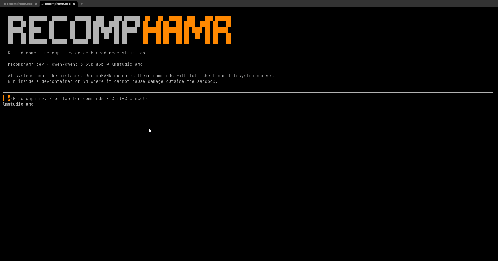

# recomphamr

A terminal coding agent forked from [CodeHAMR](https://github.com/codehamr/codehamr),
specialized for reverse-engineering and native-code projects. Built for local
LLMs, also runs on OpenAI-compatible endpoints.



## RE-first, local-first

recomphamr extends upstream CodeHAMR with RE-specific tooling: embedded skills
covering N64, PS2, PS3, Xbox, Xbox 360, SNES, Game Boy, Windows, and PC
recompilation, MCP servers for Ghidra, emulator debugging, and match
validation, project handoff docs, and a system prompt tuned for unfamiliar
codebases. Ghidra extensions (MCP bridge, XEX loader, N64 loader) are
available pre-built at **[REPlugins](https://github.com/DohmBoy64Bit/REPlugins)**
for Ghidra 12.1.2.

**Slash commands:** `/help`, `/clear`, `/models`, `/rehampass`, `/skills`,
`/skill`, `/init-re`, `/status-re`, `/doctor`, `/mcp`. Skills and MCP tools
wire into the system prompt dynamically.

## Install

Requires **Go 1.26+** and **git**.

```bash
go install github.com/DohmBoy64Bit/recomphamr/cmd/recomphamr@latest
```

Or build from source:

```bash
git clone https://github.com/DohmBoy64Bit/RecompHamr.git
cd RecompHamr
go build -o recomphamr ./cmd/recomphamr/
```

Then run `recomphamr` in your project.

> **Warning:** AI agents run model-generated shell commands with full filesystem
> access. Best run inside safe sandboxes like devcontainers or isolated VMs.

## Config

On first run recomphamr seeds `.rehamr/config.yaml` with AMD-priority profiles:
`lmstudio-amd` (default), `lmstudio-fast`, `ollama-amd`, and `llama-vulkan`.
The system prompt and RE skills are embedded in the binary.

Any OpenAI-compatible endpoint works. Example profiles:

```yaml
active: lmstudio-amd
models:
    lmstudio-amd:
        llm: deepseek-coder-v2
        url: http://localhost:1234
        key: ""
        context_size: 131072
    openai:
        llm: gpt-4.1
        url: https://api.openai.com
        key: sk-...
        context_size: 200000
```

`/models` lists profiles, `/models <name>` switches. See
**[docs/profiles.md](docs/profiles.md)** for the full profile reference.

## Hardware

For RE workloads we target **AMD GPUs** with ROCm or Vulkan backends via
llama.cpp. A **~30B-class** model on **32 GB+ VRAM** recommended. Works with
LM Studio, Ollama, or any OpenAI-compatible endpoint.

## Give the agent a runtime

recomphamr verifies by running things, so give its sandbox the toolchains your
project needs; it cannot install them itself. If a check can't run, it reports
`unverified:` instead of pretending.

## Built-in Tools

Six tools are always available to the LLM:

| Tool | Purpose |
|---|---|
| `bash` | Run shell commands |
| `read_file` | Read a file from disk |
| `write_file` | Write a file to disk |
| `edit_file` | Surgical string replacements |
| `repomixr` | Clone + pack a GitHub repo into XML for analysis |
| `recomp_reference` | Fetch and cache a web page for offline reading |

Output from `repomixr` lands in `.rehamr/repos/<owner>-<repo>/` — use
`read_file` to ingest the packed XML. Drop a `.rehamr/repomix-instruction.md`
file to inject a custom prompt. See **[docs/tool-repomixr.md](docs/tool-repomixr.md)**
for output format and flags.

## Doctor

`/doctor` validates your environment: system info, active model, all
profiles, GPU drivers, toolchain availability, MCP server status, endpoint
reachability, and workspace state. Full output reference in
**[docs/doctor.md](docs/doctor.md)**.

## Compare

| Tool | Pick if |
|---|---|
| **Frontier** | you want commercial heavyweight polish from Claude Code or Codex and accept the subscription cost |
| **[opencode](https://github.com/anomalyco/opencode)** | you want a great, loaded Swiss army knife and embrace plugin complexity |
| **[pi-agent](https://github.com/badlogic/pi-mono)** | you want something lighter than opencode and accept configuring your own extensions |
| **[CodeHAMR](https://github.com/codehamr/codehamr)** | you want the lightest coding agent with no skills, no plugins, just three slash commands |
| **recomphamr** | you do RE work (binaries, decompilation, unknown codebases), want MCP tool integration for Ghidra/Mupen64, and prefer lightweight skill-backed tooling |

## MCP Servers

recomphamr connects to MCP (Model Context Protocol) servers over stdio via
JSON-RPC 2.0, exposing their tools to the LLM.

Eight servers ship with built-in configs: `ghidra` (20 tools by default),
`n64-debug-mcp` (all tools), `pcrecomp` (8 PC recompilation tools),
`mcp-pine` (RPCS3 debug bridge), `objdiff` (object diffing),
`pcsx2` (PCSX2 debug bridge), `bizhawk` (multi-system emulator debug),
and `sega2asm` (Genesis ROM disassembler).
MCP tools are skill-gated to keep the token budget lean — zero MCP tools are
sent unless a matching skill is loaded. Servers are registered on startup but
not auto-connected by default; use `/mcp connect <name>` or set
`RECOMPHAMR_MCP_AUTOSTART=1` to auto-connect.

```
/mcp                         show server status + tool counts
/mcp connect|disconnect <n>  launch or kill a server
/mcp path <server> [path]    set or show server binary path
/mcp tools <server>          list tools (* = enabled)
/mcp enable|disable <s> <t>  toggle individual or all tools
```

Full architecture, two-gate filtering, custom servers, and tool execution flow
are documented in **[docs/mcp.md](docs/mcp.md)**. For server dependencies,
setup instructions, and env var configuration, see
**[docs/mcp-setup.md](docs/mcp-setup.md)** and **[docs/mcp-common.md](docs/mcp-common.md)**.

## Skills

Skills inject RE methodology and guardrails into the system prompt. Twenty-eight
are compiled into the binary; custom ones can be dropped in `.rehamr/skills/`.
MCP skills also gate which server tools the LLM sees.

```
/skills             list all skills (* = active, custom = from disk)
/skill <name>       load a skill (Tab to autocomplete)
```

Full details, built-in skill table, custom skill setup, and MCP pairing are
documented in **[docs/skills.md](docs/skills.md)**. For the distinction
between tools and skills, see **[docs/tools-vs-skills.md](docs/tools-vs-skills.md)**.

## Persistent Memory

recomphamr maintains `.rehamr/REPHAMR_STATE.md` — a project-wide state file
that survives sessions, restarts, and `/clear`. The LLM sees it in its system
prompt on every turn and updates it with `edit_file` after major actions.
Created by `/init-re`. Full details in **[docs/memory.md](docs/memory.md)**.

## License

[MIT](LICENSE). Fork of [CodeHAMR](https://github.com/codehamr/codehamr).
Star it if it earned one.
